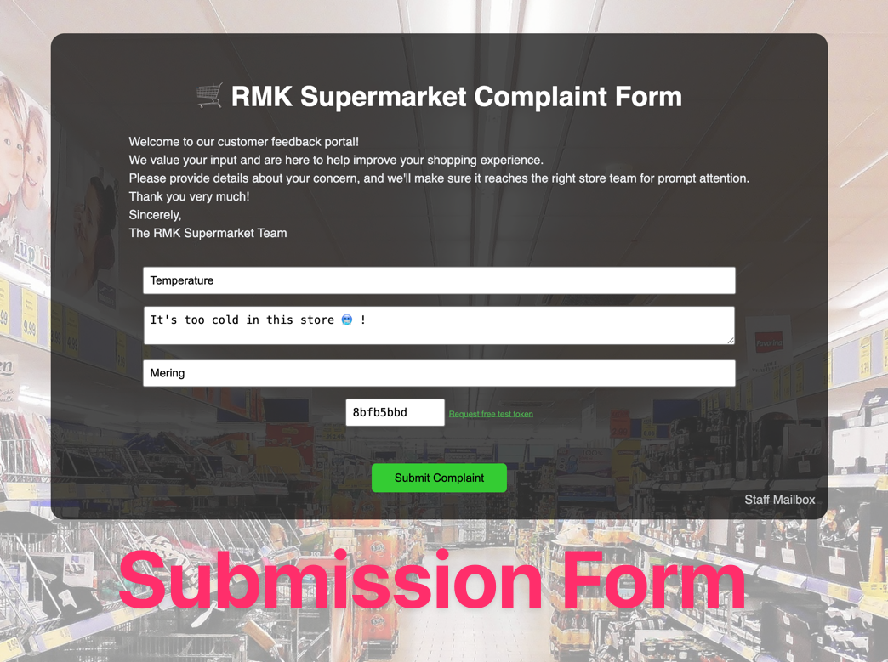
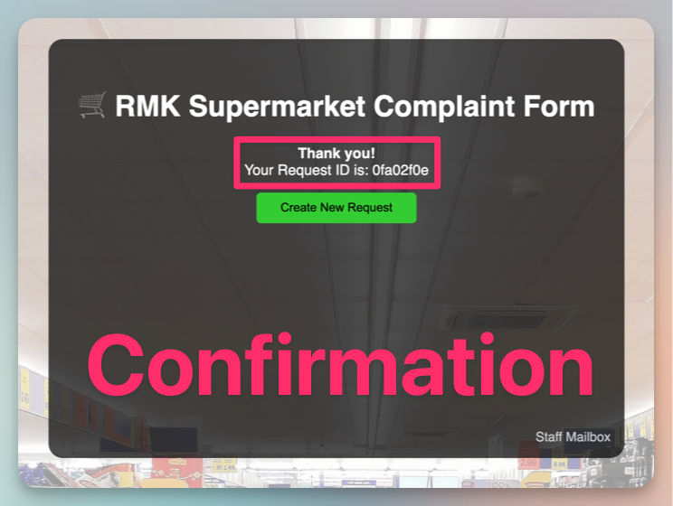
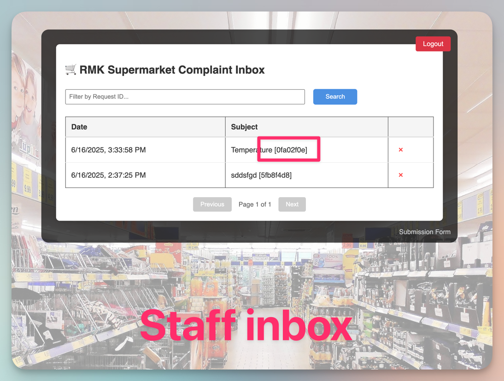

# 🛒 RMK Supermarket Complaints RF Test

This project contains tests for the demo application at [https://supermarket-complaints.demo.robotmk.org](https://supermarket-complaints.demo.robotmk.org).  
The application simulates a real-life scenario with two user interfaces:

- **Customers:** Can submit complaints via a public form.
- **Agents/Employees:** Access an inbox to read and process incoming complaints.

## Purpose

The demo highlights how a small misconfiguration can cause the agent's inbox to appear empty, misleading agents into thinking there are no complaints, while messages actually accumulate unseen.

👉 A perfect use case for Synthetic Monitoring with [Robotmk](https://www.robotmk.org) and [Checkmk](https://www.checkmk.com) !

---

## Test Description

This test:

1. Submits a complaint as a customer and receives the complaint ID. 
2. Logs in with the agent credentials and verifies that the complaint can be found via its ID in the agent's inbox.

## Usage

This demo system is made with ❤️ for users who want to learn Robot Framework and not meant as a long-term testing target.  
To accomplish this, it uses short-lived tokens (valid for 7 days) to authenticate submissions.  
At the same time, it is the password for the staff mailbox login. 

To start, follow these steps: 

1. On the submission form, click the link [Request free test token](https://cbbd9bbd.sibforms.com/serve/MUIFAAQEUu8jMFG_bx13hkPN3fqipTUkKVlopMt2ibN0fBPWK2ZURLgOQP_keMK79yUdqptLKx8Ui0ij7b19lza-GOuxv8_ozBMf-nhlrJ71upnuVW45ofCkOAVIN38L_ExBuzZbe2g2ICGQ7iLx6aCAbMzdm4kaK866YHUsfRXkqcA5HjO47mmVAaMGgEfVgACyalJbv5l6VGuB)
2. Enter your email address
3. You will receive a personal test token, valid for 7 days.
4. Copy `.robot.toml.template` to `.robot.toml` and set the variable `TOKEN` to the new token value. This allows to parametrize the Robot test from the outside with your personal token - without changing the test. How cool is that?! 😎

## Notes

- This project is for demonstration and testing purposes only.
- The demo application is reset regularly; do not use real data.

## Need support?

If you have questions or need help getting started, feel free to reach out — we're happy to support you!  
Just drop an email to [mail@robotmk.org](mail@robotmk.org).

